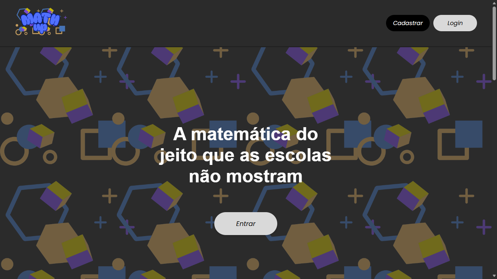

# 🧮 Match-Up

Um projeto que almeja mudar a matemática para os baixinhos.
Nosso intuito é a promoção de uma educação com qualidade para alunos do 4° e 5° ano EF, tanto através de aulas lúdicas, divertidas e, principalmente, acessíveis aos alunos.

## 🖼️ Exibição

## ⚙ Orçamento e Pré-requisitos

Para acessar nosso site, será necessário um navegador de WEB, nisso pesquise por "https://match-up.com".
Saber mexer o básico nos aparelhos ou auxílio dos responsáveis.

### 🪙 Orçamento

- Contrato anual da plataforma: R$249,99 ;
- Contrato semestral: R$199,99 ;
- Contrato mensal: R$49,99 ;
    Esteja atento às promoções periódicas - Venha fazer parte do Match-Up.

## 📦 O que nós oferecemos?

- Conteúdos exclusivos em matemática;
- Facilidade, acessibilidade e conforto;
- Aulas de preparamento OBMEP Mirim;
- Questões para fixar os conteúdos estudados durante as aulas;
- Apoio da equipe organizadora (respondendo dúvidas da cominidade).

## 📦 Objetivos

- Melhorar o índice na educação infantil, que infelizmente possui déficts no atual momento.
- Preparar alunos empenhados para representar nosso país futuramente nas olimpíadas brasileiras.

## 📱 Utilização

Acesse a trilha do conteúdo, veja aulas, reponda questôes, anote as informações mais relevantes e revise seus conhecimentos.

## 💰 Financiamento

Nosso financiamento será proveniente de inscrições da plataforma, apoio dos investidores, além de ongs e projetos na educação.

## 👨‍💻 Estrutura do projeto

Match-Up/
├── match.up
|    ├── static
|    |    ├── assets
|    |    |    └── imagens
|    |    ├── aulas
|    |    |    ├── divisão_euclidiana.pdf
|    |    |    ├── introdução_a_geometria.pdf
|    |    |    └── múltiplos_e_divisores.pdf
|    |    └── css
|    |         ├── style1equacao.css
|    |         ├── styleangulos.css
|    |         ├── stylecadastro.css
|    |         ├── stylefracao.css
|    |         ├── stylegeometria.css
|    |         ├── styleindex.css
|    |         ├── stylelogin.css
|    |         ├── stylemultiplos_e_div.css
|    |         ├── stylepagcursos.css
|    |         ├── styleperfil.css
|    |         └── stylesisenum.css
|    ├── templates
|    |    ├── 1equacao.html
|    |    ├── angulos.html
|    |    ├── aula.html
|    |    ├── cadastro.html
|    |    ├── fracao.html
|    |    ├── geometria.html
|    |    ├── index.html
|    |    ├── login.html
|    |    ├── mult-e-div.html
|    |    ├── pagcursos.html
|    |    ├── perfil.html
|    |    └── sisenum.html
|    ├── app.py
|    └── dados.csv
├── venv
|    ├─ Lib\site-packages
|    ├─ Scripts
|    ├─ .gitignore
|    ├─ CACHEDIR.TAG
|    └── pyvenv.cfg
└── README.md

### Principais Arquivos

css - Estilização completa do site.

imagens/ - Armazenamento total das imagens.

app.py - O Backend de processamento no programa.

templates/ - A estruturação das páginas.

README.md - Responsável pela descrição do arquivo.

## Licença  

Este projeto está licenciado sob a MIT License - veja o arquivo [LICENSE](LICENSE) para mais detalhes. 

  
